# Questionário

# 1. Introdução

A coleta de dados é essencial para o desenvolvimento de projetos e pesquisas, a mesma facilita a tomada de decisões, identificação de tendências/padrões, problemas e definição de um escopo. Para coleta de dados existem dezenas de técnicas, todas com suas vantagens e desvantagens, dentre essas opções uma das mais utilizadas atualmente são os questionários.

"Um questionário é um formulário impresso ou on-line com perguntas que os usuários e demais participantes devem responder, a fim de fornecer os dados necessários em uma pesquisa, análise ou avaliação."<a id="TEC1" href="#QT1">[1]</a>

O questionário é amplamente utilizado pois o mesmo permite a coleta e análise de dados relevantes em grandes grupos de forma rápida e eficaz.

# 2. Estrutura do questionário

Nosso questionário foi estruturado em seções com o intuito de definir o perfil dos usuários que utilizam o applicativo Detran digital.

* Seção 01 | Introdução

Apresentação do grupo e de nosso termo de consentimento para que o participante compreenda que a participação é totalmente vonlutária e que os dados fornecidos serão utilizados apenas para fins acadêmicos.

* Seção 02 | Verificação de Uso

A segunda seção vem com o intuito de filtrar os participantes, tendo em vista que desejamos realizar a coleta de dados para descobrir o perfil dos usuários não é possível utilizar os dados de pessoas que não tenham contato com o aplicativo do Detran (do df ou de outras regiões).

* Seção 03 | Dados demográficos

A coleta de dados demográficos em um questionário é crucial para compreender a composição do público-alvo, permitindo a personalização de estratégias e a adaptação de produtos ou serviços de acordo com as características dos participantes, contribuindo para uma abordagem mais eficaz e direcionada.

* Seção 04 | Aplicativo Detran Digital

A última seção do nosso questionário vem com o intuito de visualizar quais os principais interesses dos uuários dentro do aplicativo do detran digital, sendo assim podemos descobrir quais os principais usos e quais os menos utilizados.

# 3. Resultados

Após a divulgação do questionário em diversos grupos (faculdade, trabalho e família) obtemos 23 respostas. 

* Seção 01 | Introdução

Os 23 participantes aceitaram o termo de consentimento.

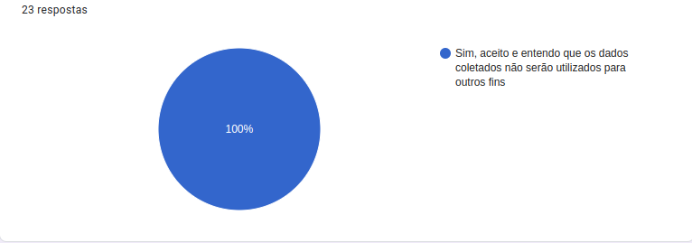

* Seção 02 | Verificação de Uso

A maioria dos participantes ou conhecem ou acessam o Detran de suas respectivas regiões.

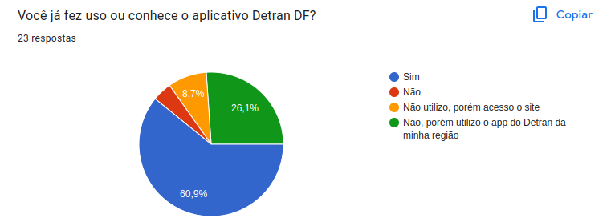

* Seção 03 | Dados demográficos

Essa seção mostra que os participantes são jovens entre 18 a 25 anos com certo conhecimento em tecnologia e ensino superior incompleto.

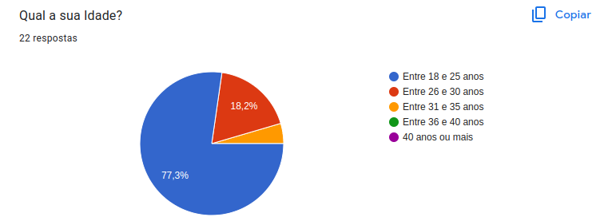

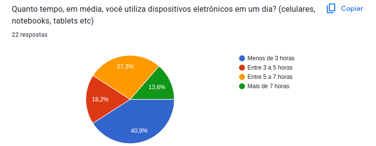

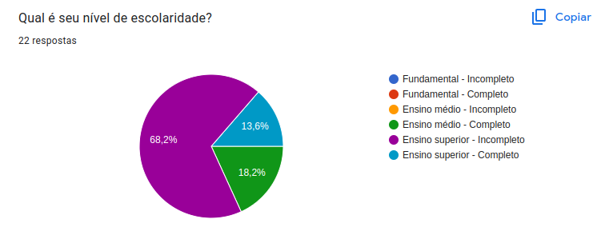

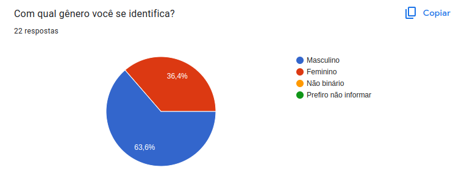

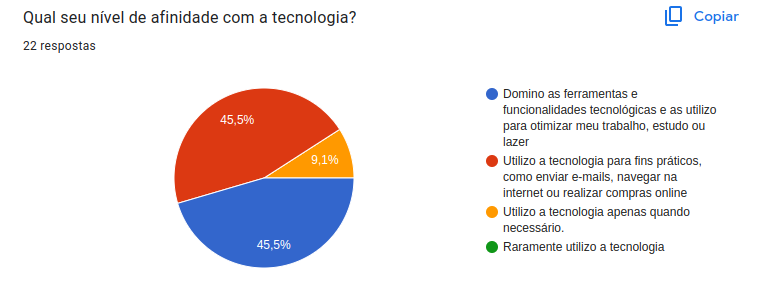

* Seção 04 | Aplicativo Detran Digital

Os participantes possuem em maioria CNH categoria AB, dirigem quatro vezes ou mais por semana e as principais funções utilizadas no app são as relacionadas a emissão de crlv-e, quitação de débitos e consulta de infrações.

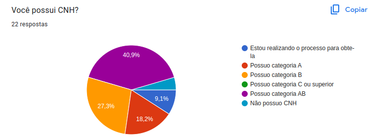

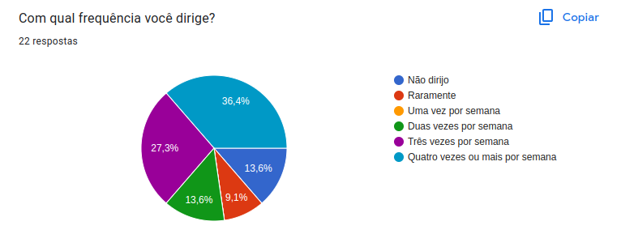

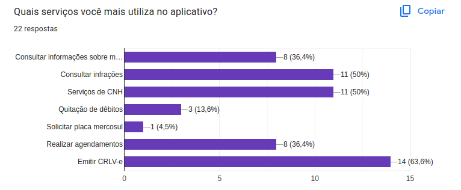

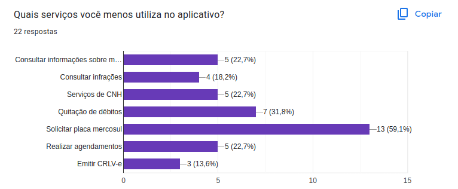

# 4. Tabela de Requisitos

## Tabela de requisitos
A tabela 1 disposta abaixo representa todos os requisitos levantados durante a análise de documentos, identificados com 'RQ' + numero do requisito, e com a seguinte legenda de categoria:

RF: Requisitos Funcionais - Descrevem o comportamento ou a funcionalidade que o software deve ter para atender às necessidades do usuário.

RNF: Requisitos Não-Funcionais - Descrevem os atributos que o software deve ter, como desempenho, segurança e usabilidade, mas não descrevem o comportamento do software em si.

RI: Requisitos de Interface - Descrevem as características da interface do usuário, como layout, navegação e personalização.

RPR: Requisitos de Produto - Descrevem as características do produto, como compatibilidade, desempenho e custo.

RR: Riscos - São os riscos associados ao desenvolvimento e uso do software.

RT: Testes e Validações - Descrevem as atividades necessárias para testar e validar o software antes de sua implantação.

| Número do Requisito | Categoria              | Descrição                                                   |
|---------------------|------------------------|-------------------------------------------------------------|
| RQ1 | RF | Consultar informações sobre veículos |
| RQ2 | RF | Consultar infrações |
| RQ3 | RNF | Possuir os serviços de CNH a disposição no aplicativo |
| RQ4 | RF | Emitir CRLV-e |
| RQ5 | RF | Realizar agendamentos no detran |

## Referências
> <a id="QT1" href="#anchor_1">[1] Barbosa, S. D. J.; Silva, B. S. da; Silveira, M. S.; Gasparini, I.; Darin, T.; Barbosa, G. D. J. (2021)
Interação Humano-Computador e Experiência do usuário. Questionários - Pg. 148</a> 

# Histórico de versão

| Versão | Data       | Descrição            | Autor              | Revisor             |
| ------ | ---------- | -------------------- | ------------------ | ------------------- |
| 1.0    | 03/10/2023 | Adicionado introdução sobre questionários | Vitor Borges | João Gabriel |
| 1.1    | 03/10/2023 | Adicionado estrutura do questionário | Vitor Borges | João Gabriel |
| 1.2    | 03/10/2023 | Adicionado resultados do questionário | Vitor Borges | João Gabriel |
| 1.2    | 04/10/2023 | Adicionado tabela de requisitos | Vitor Borges | João Gabriel |