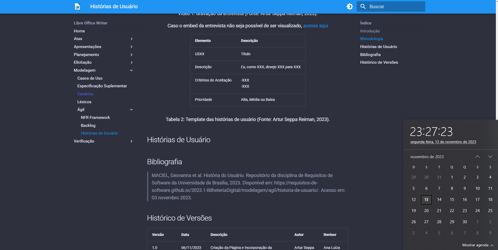

# Verificação Historias de Usuario

# Introdução

A verificação de software é um processo sistemático de avaliação e revisão do código fonte, design e documentação de um programa de computador com bjetivo principal de garantir que o software atenda aos requisitos especificados e que funcione conforme o esperado. 

Esse documento tem o objetivo de documentar as verificações realizadas no artefato das Historias de Usuario.O documento ira abordar atraves do uso de uma checklist para verificar os items do artefato.

# Objetivo

O artefato de verificação de Historias de Usuario tem o objetivo de documentar se o artefato foi realizado e se foi feito da maneira correta seguindo os padrões gerais estabelecidos pela disciplina e se os itens do artefato em questão foram realizados da maneira correta

## Apresentação dos dados

Nesta etapa, os resultados obtidos serão apresentados de acordo com o checklist utilizado. Para cada item do checklist, será apresentado o resultado obtido e, caso o resultado seja negativo, será apresentado também o problema encontrado.

## Checklist geral

Na tabela 1, é possível visualizar os resultados obtidos na verificação do artefato "[Histórias de Usuários](https://requisitos-de-software.github.io/2023.2-LibreOffice/modelagem/agil/historiasDeUsuario/)" em relação ao checklist geral.

<b>Tabela 1:</b> Tabela do checklist geral do artefato "Histórias de Usuário" 

<<table>
    <tr>
      <th>ID</th>
      <th>Conteudo</th>
      <th>Possui</th>
      <th>Qualidade</th>
      <th>Comentario</th>
    </tr>
    <tr>
      <td>1</td>
      <td>O artefato possui autor?</td>
      <td>Sim</td>
      <td>Ótimo</td>
      <td>Sem Comentário</td>
    </tr>
    <tr>
      <td>2</td>
      <td>O artefato possui revisor?</td>
      <td>Sim</td>
      <td>Ótimo</td>
      <td>Sem Comentário</td>
    </tr>
    <tr>
      <td>3</td>
      <td>O histórico de versão está padronizado?</td>
      <td>Sim</td>
      <td>Ótimo</td>
      <td>Poucas Versões</td>
    </tr>
    <tr>
      <td>4</td>
      <td>Todas as ferramentas do projeto foram citadas?</td>
      <td>Sim</td>
      <td>Ótimo</td>
      <td>Sem Comentário</td>
    </tr>
    <tr>
      <td>5</td>
      <td>O artefato possui referências bibliográficas?</td>
      <td>Sim</td>
      <td>Ótimo</td>
      <td>Sem Comentário</td>
    </tr>
    <tr>
      <td>6</td>
      <td>O artefato possui tabelas e imagens com legenda e fonte, e elas são chamadas dentro dos texto?</td>
      <td>Sim</td>
      <td>Ótimo</td>
      <td>Sem Comentário</td>
    </tr>
    <tr>
      <td>7</td>
      <td>O artefato possui um texto fazendo uma introdução?</td>
      <td>Sim</td>
      <td>Ótimo</td>
      <td>Sem Comentário</td>
    </tr>
    <tr>
      <td>8</td>
      <td>O artefato possui links para os outros artefatos?</td>
      <td>Sim</td>
      <td>Ótimo</td>
      <td>Sem Comentário</td>
    </tr>
  </table>

<b>Fonte:</b> <a href="https://github.com/pedrocampos0">Pedro Campos</a>, 2023

## Checklist Específico

Na tabela 2, é possível visualizar os resultados obtidos na verificação do artefato "[Histórias de Usuário](https://requisitos-de-software.github.io/2023.2-LibreOffice/modelagem/agil/historiasDeUsuario/)" em relação ao checklist específico.

<b>Tabela 2:</b> Tabela do checklist específica do artefato "Histórias de Usuário" 

<table>
  <thead>
    <tr>
      <th>ID</th>
      <th>Conteúdo</th>
      <th>Possui</th>
      <th>Qualidade</th>
      <th>Comentário</th>
    </tr>
  </thead>
  <tbody>
    <tr>
      <td>1</td>
      <td>Os títulos das histórias de usuário são auto-explicativos?</td>
      <td>Não</td>
      <td>Ruim</td>
      <td>Sem Comentário</td>
    </tr>
    <tr>
      <td>2</td>
      <td>O "quem", "o que" e o "por que" estão definidos na história de usuário?</td>
      <td>Não</td>
      <td>Ruim</td>
      <td>Sem Comentário</td>
    </tr>
    <tr>
      <td>3</td>
      <td>A participação do cliente e/ou persona na validação das histórias de usuário?</td>
      <td>Sim</td>
      <td>Ótimo</td>
      <td>Sem Comentário</td>
    </tr>
    <tr>
      <td>4</td>
      <td>A história possui critérios de aceitação?</td>
      <td>Não</td>
      <td>Ruim</td>
      <td>Sem Comentário</td>
    </tr>
    <tr>
      <td>5</td>
      <td>Os critérios de aceitação das histórias foram definidos?</td>
       <td>Não</td>
      <td>Ruim</td>
      <td>Sem Comentário</td>
    </tr>
    <tr>
      <td>6</td>
      <td>A participação do cliente e/ou persona na elicitação de requisitos?</td>
      <td>Sim</td>
      <td>Ótimo</td>
      <td>Sem Comentário</td>
    </tr>
    <tr>
      <td>7</td>
      <td>Todas as histórias de usuário podem ser testadas?</td>
      <td>Não</td>
      <td>Ruim</td>
      <td>Sem Comentário</td>
    </tr>
    <tr>
      <td>7</td>
      <td>O link do vídeo da entrevista com o PO está correto?</td>
      <td>Sim</td>
      <td>Mediana</td>
      <td>Ao clicar no vídeo embed sou direcionado para o vídeo correto <a
          href="https://www.youtube.com/watch?v=wZxL0vVdUFY">Libre Office Writer</a>, ao clicar no "acesse aqui" sou
        direcionado para o link do grupo <a href="https://www.youtube.com/embed/2o3diusGVC8">Bilheteria Digital.</a>
      </td>
    </tr>
  </tbody>
</table>

<b>Fonte:</b> <a href="https://github.com/pedrocampos0">Pedro Campos</a>, 2023

## Problemas encontrados

Nesta seção, serão apresentados os problemas encontrados durante a verificação do artefato "[Histórias de Usuário](https://requisitos-de-software.github.io/2023.2-LibreOffice/modelagem/agil/historiasDeUsuario/)".

## Checklist geral

- O artefato atendeu às expectativas cumprindo todos os itens do checklist, contudo o link para o termo de consetimento não está funcional.

## Checklist Específico

- O artefato não atendeu às expectativas, não possuía a maioria dos itens do checklist, o artefato possuía: Introdução, Metodologia, Vídeo de entrevista, Template, Bibliografia e Histórico de versão. Porém não possuía as histórias de usuário.

# Historico de versão!

| Versão | Data       | Descrição            | Autor                                           | Revisor   |
| ------ | ---------- | -------------------- | ----------------------------------------------- | --------- |
| 1.0    | 13/11/2023 | Criação do documento | [Pedro Campos](https://github.com/pedrocampos0) | Guilherme |
|        |            |                      |                                                 |           |