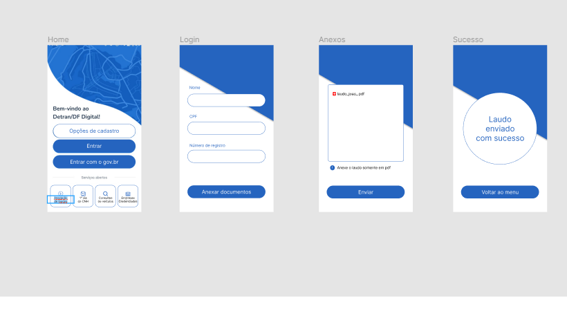
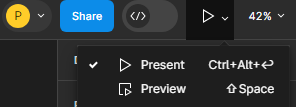

# Métodos de pagamento

# Introdução

A validação de software é um processo sistemático que consiste em aferir se uma determinada funcionalidade do produto de software está funcional. Para realizar a abordagem desta técnica da engenharia de software, iremos trazer funcionalidades que não foram implementadas dentro do aplicativo do Detran por meio de uma prototipação dessas funcionalidades. Para realizar a prototipação, foi utilizada a ferramenta [Figma](https://www.figma.com).

# Objetivo

Esse documento tem o objetivo de documentar se a prototipação da funcionalidade de [Anexar
os laudos](https://www.figma.com/file/OXOQHKs7V40ObAqoh6Ki9u/Requisitos-team-library?type=design&node-id=2313-6&mode=design&t=uepja70URNgLfRbc-0) iria ajudar no uso do aplicativo do Detran, facilitando a vida do usuário.

# Cliente

| Nome | Data da entrevista       | Estava de acordo com o termo de Uso/Imagem                 | Tipo de Feedback              | Entrevistador |
| ------ | ---------- | -------------------------- | ------------------- | ------- |
| Amanda Curione de Castro   | 04/12/2023 |  Sim     | Positivo | João Gabriel Elvas   |

# Como acessar a [prototipação](https://www.figma.com/file/OXOQHKs7V40ObAqoh6Ki9u/Requisitos-team-library?type=design&node-id=2313-6&mode=design&t=uepja70URNgLfRbc-0)

- [Acesse o link](https://www.figma.com/file/OXOQHKs7V40ObAqoh6Ki9u/Requisitos-team-library?type=design&node-id=2313-6&mode=design&t=uepja70URNgLfRbc-0) e no canto superior direito, clique no ícone play.

- Agora só clicar em "Present". 

# Link do vídeo da validação

[Link do vídeo da validação do protótipo](https://youtu.be/-vPuLM29oR4)

# Historico de versão

| Versão | Data       | Descrição                  | Autor               | Revisor |
| ------ | ---------- | -------------------------- | ------------------- | ------- |
| 1.0    | 04/12/2023 | Criação do documento       | João Gabriel Elvas | Pedro Campos |