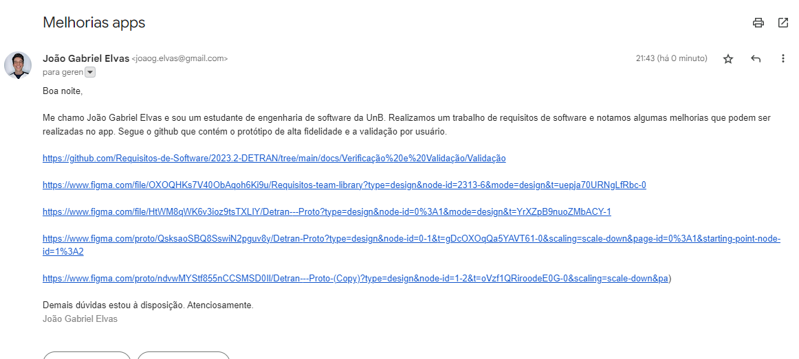

# Apresentação Final

## Aplicativo Escolhido (Detran digital)

### Critérios de avaliação
* Aplicativo não ter sido trabalhado na disciplina;
* Facilidade de contato com o público-alvo;
* Complexidade do aplicativo;
* Disponibilidade de informações.
### Motivações para escolha
Baseado nos critérios anteriores, e após instrução do professor, o grupo decidiu escolher o aplicativo do Detran Digital. Entre as motivações, estas são as principais:

* Aplicativo de complexidade média, ou seja, nem muito complexo para o escopo da disciplina, nem muito simplório para a quantidade de integrantes do grupo, que apresenta requisitos funcionais e não funcionais que serão trabalhados no projeto.
* Público-alvo amplo e de fácil acesso. Visto que o aplicativo aborda algo do cotidiano de muitas pessoas e o escopo de faixa etária é alto.
* Site do governo.

## Cronogramas planejados e executados

Na etapa inicial do projeto foi definido um cronograma base a ser seguido afim de garantir uma consistencia na criação dos artefatos, ademais durante cada entrega do projeto foram documentados os cronogramas realizados consistindo em tabelas onde se e possivel identificar a Atividade,inicio,fim,autores e revisores.

Todas as tabelas referentes a ambos os cronogramas preenchidos podem ser ascessados no artefato de [cronograma](https://requisitos-de-software.github.io/2023.2-DETRAN/cronograma/cronograma_de_atividades/).

## O que foi feito em cada etapa 

### Etapa 1

Nesta etapa a equipe foi responsavel por fazer o planejamento de ferremantas e do cronograma  e a escolha do aplicativo, que dentre as diversas opções levantadas pela equipe o aplicativo escolhido em conjunto foi o Detran Digital. A tabela x abaixo faz a descrição de cada artefato.

| Artefato | Versão | Data | Descrição |
|----------|--------|------|----------|
| [Rich Picture](https://requisitos-de-software.github.io/2023.2-DETRAN/1_planejamento/Rich_picture/) | 1.0 | 06/11/2023 |  Neste Artefato a equipe desenvolveu a tecnica de Rich Picture para o aplicativo Detran digitial.  | 
| [Aplicativos](https://requisitos-de-software.github.io/2023.2-DETRAN/1_planejamento/aplicativos/) | 1.0 | 06/11/2023 | Este Artefato consiste em detalhar os aplicativos analisados e os motivos que levaram a equipe a escolher o Detran Digital   |        
| [Ferramentas](https://requisitos-de-software.github.io/2023.2-DETRAN/1_planejamento/ferramentas/) | 1.0 | 06/11/2023 | Informações contendo que ferramentas foram utilizadas durante o projeto pela equipe bem como sua descrição da sua funcionalidade   | 
| [Termos de uso](https://requisitos-de-software.github.io/2023.2-DETRAN/1_planejamento/termos/) | 1.0 | 06/11/2023 | Termos de uso do aplicativo Detran Digital que permitem fazer o uso do mesmo no projeto sem ferir algum direito legal.   |

Tabela : Etapa 1 (Fonte:Guilherme Nishimura 2023).

### Etapa 2

A etapa 2 tambem conhecida como elicitação e priorização consistiu em aplicar tecnicas de elicitção de requisitos e após essa elicitação saber a priorização dos requisitos com outras tecnicas .

| Artefato | Versão | Descrição |
|----------|--------|-----------|
| [First Thing First](https://requisitos-de-software.github.io/2023.2-DETRAN/2_elicitação/FTF/) | 1.0 | Este artefato consiste em demonstrar a priorização dos requisitos com base na técnica First Thing First. | 
| [Análise de documentos](https://requisitos-de-software.github.io/2023.2-DETRAN/2_elicitação/analise_de_documentos/) | 2.0 | Este artefato consiste em demonstrar a elicitação dos requisitos com base na técnica Análise de documentos. |  
| [Entrevista](https://requisitos-de-software.github.io/2023.2-DETRAN/2_elicitação/entrevista/) | 2.0 | Este artefato consiste em demonstrar a elicitação dos requisitos com base na técnica Entrevista. | 
| [Priorização In or Out](https://requisitos-de-software.github.io/2023.2-DETRAN/2_elicitação/in_or_out/) | 2.0 | Este artefato consiste em demonstrar a priorização dos requisitos com base na técnica Priorização In or Out. | 
| [Moscow](https://requisitos-de-software.github.io/2023.2-DETRAN/2_elicitação/moscow/) | 2.0 | Este artefato consiste em demonstrar a priorização dos requisitos com base na técnica MOSCOW. | 
| [Personas](https://requisitos-de-software.github.io/2023.2-DETRAN/2_elicitação/personas/) | 2.0 | Este artefato consiste em demonstrar o perfil do usuário com base na técnica Personas.|  
| [Questionário](https://requisitos-de-software.github.io/2023.2-DETRAN/2_elicitação/questionario/) | 2.0 | Este artefato consiste em demonstrar a elicitação dos requisitos, bem como o perfil do usuário, com base na técnica Questionário. | 
| [Requisitos elicitados](https://requisitos-de-software.github.io/2023.2-DETRAN/2_elicitação/requisitos_elicitados/) | 2.0 | Este artefato consiste em agregar as informações e elicitar os requisitos. | 
| [Storytelling](https://requisitos-de-software.github.io/2023.2-DETRAN/2_elicitação/storytelling/) | 2.0 | Este artefato consiste em demonstrar a elicitação dos requisitos, bem como o perfil do usuário, com base na técnica Storytelling. |

Tabela : Etapa 2 (Fonte:Guilherme Nishimura 2023).

### Etapa 3

Nesta etapa tambem conhecida como modelagem a equipe documento os comportamento do sistema assim como as semanticas importantes .

| Artefato | Versão | Descrição |
|----------|--------|----------|
| [Casos de uso](https://requisitos-de-software.github.io/2023.2-DETRAN/3_modelagem/casos_de_uso/) | 1.0 | O artefato casos de uso consiste em utilizar as tecnicas de modelagem para analisar o comportamento so sistema com o usúário.  |
| [Cenários](https://requisitos-de-software.github.io/2023.2-DETRAN/3_modelagem/cenarios/) | 2.0 | Utilização da tecnica de cenários para descerver os possiveis cenários ao aplicativo Detran digital|       
| [Especificação suplementar](https://requisitos-de-software.github.io/2023.2-DETRAN/3_modelagem/especificacao_suplementar/) | 2.1 | Artefado criado para estabelecer os requisitos adicionais e as expectativas para o Detran Digital. | 
| [Léxico](https://requisitos-de-software.github.io/2023.2-DETRAN/3_modelagem/lexico/) | 2.0 |Artefato cuja finalidade consiste em especificar as semntaticas relacionadas a uma palavra dentro do contexto do Detran Digital. |

Tabela : Etapa 3 (Fonte:Guilherme Nishimura 2023).

### Etapa 4

Etapa da modelagem agil que consistiu em Estabelecer um organização  melhor do backlog ,usúarios e requisitos.

| Artefato | Versão | Técnicas |
|----------|--------|----------|
| [NFR](https://requisitos-de-software.github.io/2023.2-DETRAN/4_modelagem_agil/NFR/) | 1.1 | Artefato criado para utilizar a técnica NFR Framework para lidar com os requisitos que não se relacionam diretamente com as funcionalidades de um sistema de software. |
| [Backlog do produto](https://requisitos-de-software.github.io/2023.2-DETRAN/4_modelagem_agil/backlog/) | 1.2 | Traz o backlog do projeto (lista de itens pendentes, tarefas ou funcionalidades a serem realizadas em um projeto ou processo).|       
| [Histórias de Usuários](https://requisitos-de-software.github.io/2023.2-DETRAN/4_modelagem_agil/historias_de_usuarios/) | 2.1 | Utilização das técnicas de histórias de usuários para especificar os elementos do backlog de um projeto. |

Tabela : Etapa 4 (Fonte:Guilherme Nishimura 2023).

### Etapa 5
Esta etapa foi dividido em 5.1 e 5.2 :

#### 5.1

Equipe ficou responsavel por fazer a verificação do projeto do grupo  N+1 ,que seria o grupo 8 :[Libre Office Writers](https://requisitos-de-software.github.io/2023.2-LibreOffice/) 

| Artefato | Versão | Técnicas |
|----------|--------|----------|
| [Verificações](https://requisitos-de-software.github.io/2023.2-DETRAN/Verificacao_grupo_8/Entrega_1/verificacao_aplicativos/) | 1.0 | Coletania de verificações referentes aos artefatos do grupo [Libre Office Writers](https://requisitos-de-software.github.io/2023.2-LibreOffice/)  |

Tabela : Etapa 5.1 (Fonte:Guilherme Nishimura 2023).

#### 5.2
Etapa para fazer  a verificação do proprio  projeto ,alem de fazer as validações dos prototipos :

| Artefato | Versão | Técnicas |
|----------|--------|----------|
| [Verificações](http://127.0.0.1:8000/Verificação%20e%20Validação/Verificacao/Geral/) | 3.0 |Coletania de verificações referentes aos artefatos do proprio Grupo e inspeções|
| [Validações](http://127.0.0.1:8000/Verificação%20e%20Validação/Validação/metodos_pagamento/) | 2.0 | Artefato com os prototipos de alta fidelidade e validação com o usuário |

Tabela : Etapa 5.2 (Fonte:Guilherme Nishimura 2023).

### Etapa 6
Etapa cuja finalidade foi vincular os requisitos  que são criados durante o ciclo de vida de desenvolvimento do sistema.

| Artefato | Versão | Técnicas |
|----------|--------|----------|
| [Backward-From](https://requisitos-de-software.github.io/2023.2-DETRAN/pos_rastreabilidade/backward_from/) | 1.1 | Artefato contendo a técnica de Backward-From para matriz de rastreabilidade. |
| [Forward-From](https://requisitos-de-software.github.io/2023.2-DETRAN/pos_rastreabilidade/forward-from/) | 2.0 | Artefato contendo a técnica de Forward-From. |
| [Matriz de rastreabilidade](https://requisitos-de-software.github.io/2023.2-DETRAN/pos_rastreabilidade/matriz_de_rastreabilidade/) | 2.1 | Artefato contendo a matriz geral de rastreabilidade do projeto. |

Tabela : Etapa 6 (Fonte:Guilherme Nishimura 2023).

## Resultados alcançados

Esta seção apresenta os resultados obtidos ao término do projeto conduzido. No desenvolvimento do projeto, nossa equipe empenhou-se em realizar uma análise das principais necessidades dos usuários, os requisitos já atendidos pelo aplicativo e requisitos que poderiam ser implementados no aplicativo. Buscamos utilizar métodos e ferramentas para auxiliar no desenvolvimento preciso e embasado do projeto.

### Conhecimentos Adquiridos

No desenvolvimento do projeto, a equipe adquiriu e aplicou conhecimentos na identificação, documentação e validação de requisitos. Além do conhecimento técnico foi necessário buscar meios de estabelecer comunicação entre os usuários e a equipe de desenvolvimento para a validação e a evolução dos artefatos. Este percurso não apenas solidificou nosso conhecimento técnico como fortaleceu nossa capacidade de análise crítica. Além disso destacou a importância da colaboração e adaptação contínua para o desenvolvimento de software.

### Compreensão das necessidades

No decorrer do desenvolvimento do projeto, com a criação e evolução dos artefatos foi possível ao entrar em contato com os usuários, a partir destes contatos diretos foi possível entender suas necessidades, expectativas e como eles utilizam o aplicativo. Esta compreensão resultou em especificações mais claras e alinhadas com as expectativas dos usuários.

### Requisitos não elicitados

Conforme os artefatos foram sendo criados, requisitos não implementados foram elicitados a partir da análise das demandas dos usuários que permitiu a criação de especificações mais precisas. Estes requisitos foram sendo aprimorados no desenvolvimento do projeto e nas etapas finais foi possível criar e validar protótipos diretamente com os clientes.

## Tecnicas utilizadas em cada etapa do projeto

### Etapa 1

Na tabela 1 estão os artefatos verificados e os responsáveis pela verificação.

| Artefato | Versão | Data | Técnicas | Técnicas utilizadas por |
|----------|--------|------|----------------|----------------|
| [Rich Picture](https://requisitos-de-software.github.io/2023.2-DETRAN/1_planejamento/Rich_picture/) | 2.0 | 04/11/2023 | 

 Desenho à mão livre de um Rich Picture
 Trata-se de uma técnica que consiste em realizar um desenho à mão livre, com o objetivo de expressar uma ideia de forma simples e de fácil entendimento. 
 

Busca de informações
 Consiste em obter informações que serão necessárias para a criação do artefato 
 | 

Integrantes
 [@Guilherme-Nishi ](https://github.com/Guilherme-Nishi), [@pedrocampos0](https://github.com/pedrocampos0), [@VitorB2002](https://github.com/VitorB2002) 
 | 
| [Aplicativos](https://requisitos-de-software.github.io/2023.2-DETRAN/1_planejamento/aplicativos/) | 2.0 | 04/11/2023 | 

Consulta aos integrantes do grupo
 Os integrantes do grupo forneceram as informações necessárias para a criação do artefato. 
 

Busca de informações
 Consiste em obter informações que serão necessárias para a criação do artefato 
 |

Integrantes
 [@joãopedro](https://github.com/jpanacleto2), [@Guilherme-Nishi ](https://github.com/Guilherme-Nishi), [@pedrocampos0](https://github.com/pedrocampos0), [@JoaoGElvas](https://github.com/JoaoGElvas), [@VitorB2002](https://github.com/VitorB2002) 
 |        
| [Ferramentas](https://requisitos-de-software.github.io/2023.2-DETRAN/1_planejamento/ferramentas/) | 2.0 | 04/11/2023 | 

Consulta aos integrantes do grupo
 Os integrantes do grupo forneceram as informações necessárias para a criação do artefato. 
 |

Integrantes
 [@joãopedro](https://github.com/jpanacleto2), [@Guilherme-Nishi ](https://github.com/Guilherme-Nishi), [@pedrocampos0](https://github.com/pedrocampos0), [@JoaoGElvas](https://github.com/JoaoGElvas), [@VitorB2002](https://github.com/VitorB2002) 
 | 
| [Termos de uso](https://requisitos-de-software.github.io/2023.2-DETRAN/1_planejamento/termos/) | 2.0 | 04/11/2023 | 

Busca de informações
 Consiste em obter informações que serão necessárias para a criação do artefato 
 |

Integrantes
 [@joãopedro](https://github.com/jpanacleto2), [@Guilherme-Nishi ](https://github.com/Guilherme-Nishi), [@pedrocampos0](https://github.com/pedrocampos0), [@JoaoGElvas](https://github.com/JoaoGElvas), [@VitorB2002](https://github.com/VitorB2002) 
 |  

*Fonte: Pedro Campos*

### Etapa 2

| Artefato | Versão | Data | Técnicas | Técnicas utilizadas por |
|----------|--------|------|----------------|----------------|
| [First Thing First](https://requisitos-de-software.github.io/2023.2-DETRAN/2_elicitação/FTF/) | 2.0 | 04/11/2023 | 

Técnica de priorização
 Uma técnica de priorização, é nada mais nada menos que uma forma de ordenar a importância de cada requisito elicitado, para que cada requisito tenha um nível de importância definido. 
 | 

Integrantes
 [@joãopedro](https://github.com/jpanacleto2), [@Guilherme-Nishi ](https://github.com/Guilherme-Nishi), [@pedrocampos0](https://github.com/pedrocampos0), [@VitorB2002](https://github.com/VitorB2002) 
 |
| [Análise de documentos](https://requisitos-de-software.github.io/2023.2-DETRAN/2_elicitação/analise_de_documentos/) | 2.0 | 04/11/2023 | 

Técnica de elicitação
 Uma técnica de elicitação, é nada mais nada menos que uma forma de obter requisitos, cada tipo de técnica possui suas particularidades para elicitar um requisito. Todas técnicas de elicitação tem o mesmo objetivo: elicitar os requisitos de um determinado projeto/produto de software. 
 

Busca de informações
 Consiste em obter informações que serão necessárias para a criação do artefato 
 | 

Integrantes
 [@joãopedro](https://github.com/jpanacleto2), [@pedrocampos0](https://github.com/pedrocampos0), [@VitorB2002](https://github.com/VitorB2002) 
 |  
| [Entrevista](https://requisitos-de-software.github.io/2023.2-DETRAN/2_elicitação/entrevista/) | 2.0 | 04/11/2023 | 

Técnica de elicitação
 Uma técnica de elicitação, é nada mais nada menos que uma forma de obter requisitos, cada tipo de técnica possui suas particularidades para elicitar um requisito. Todas técnicas de elicitação tem o mesmo objetivo: elicitar os requisitos de um determinado projeto/produto de software. 
 

Entrevista híbrida
 A junção entre entrevista aberta e entrevista fechada. As entrevistas abertas permitem improvisação com base nas respostas do usuário entrevistado, enquanto as entrevistas fechadas têm perguntas predefinidas. 
 | 

Integrantes
 [@pedrocampos0](https://github.com/pedrocampos0), [@VitorB2002](https://github.com/VitorB2002) 
 | 
| [Priorização In or Out](https://requisitos-de-software.github.io/2023.2-DETRAN/2_elicitação/in_or_out/) | 2.0 | 04/11/2023 | 

Técnica de priorização
 Uma técnica de priorização, é nada mais nada menos que uma forma de ordenar a importância de cada requisito elicitado, para que cada requisito tenha um nível de importância definido. 
 | 

Integrantes
 [@Guilherme-Nishi ](https://github.com/Guilherme-Nishi), [@pedrocampos0](https://github.com/pedrocampos0), [@VitorB2002](https://github.com/VitorB2002) 
 | 
| [Moscow](https://requisitos-de-software.github.io/2023.2-DETRAN/2_elicitação/moscow/) | 2.0 | 04/11/2023 | 

Técnica de priorização
 Uma técnica de priorização, é nada mais nada menos que uma forma de ordenar a importância de cada requisito elicitado, para que cada requisito tenha um nível de importância definido. 
 | 

Integrantes
 [@Guilherme-Nishi ](https://github.com/Guilherme-Nishi), [@pedrocampos0](https://github.com/pedrocampos0), [@VitorB2002](https://github.com/VitorB2002) 
 |
| [Personas](https://requisitos-de-software.github.io/2023.2-DETRAN/2_elicitação/personas/) | 2.0 | 04/11/2023 | 

Técnica de elicitação
 Uma técnica de elicitação, é nada mais nada menos que uma forma de obter requisitos, cada tipo de técnica possui suas particularidades para elicitar um requisito. Todas técnicas de elicitação tem o mesmo objetivo: elicitar os requisitos de um determinado projeto/produto de software. 
 

Perfil do usuário
 Trata-se de utilizar o perfil do usuário que utiliza o produto de software analisado, contendo as características desse usuário. 
 | 

Integrantes
 [@joãopedro](https://github.com/jpanacleto2), [@pedrocampos0](https://github.com/pedrocampos0), [@VitorB2002](https://github.com/VitorB2002) 
 |  
| [Questionário](https://requisitos-de-software.github.io/2023.2-DETRAN/2_elicitação/questionario/) | 2.0 | 04/11/2023 | 

Técnica de elicitação
 Uma técnica de elicitação, é nada mais nada menos que uma forma de obter requisitos, cada tipo de técnica possui suas particularidades para elicitar um requisito. Todas técnicas de elicitação tem o mesmo objetivo: elicitar os requisitos de um determinado projeto/produto de software. 
 

Perfil do usuário
 Trata-se de utilizar o perfil do usuário que utiliza o produto de software analisado, contendo as características desse usuário. 
 | 

Integrantes
 [@pedrocampos0](https://github.com/pedrocampos0), [@JoaoGElvas](https://github.com/JoaoGElvas), [@VitorB2002](https://github.com/VitorB2002) 
 | 
| [Requisitos elicitados](https://requisitos-de-software.github.io/2023.2-DETRAN/2_elicitação/requisitos_elicitados/) | 2.0 | 04/11/2023 | 

Junção de informações
 Consiste em agrupar todas as informações de artefatos diferentes em apenas um único artefato. 
 | 

Integrantes
 [@joãopedro](https://github.com/jpanacleto2), [@pedrocampos0](https://github.com/pedrocampos0), [@VitorB2002](https://github.com/VitorB2002) 
 |
| [Storytelling](https://requisitos-de-software.github.io/2023.2-DETRAN/2_elicitação/storytelling/) | 2.0 | 04/11/2023 | 

Técnica de elicitação
 Uma técnica de elicitação, é nada mais nada menos que uma forma de obter requisitos, cada tipo de técnica possui suas particularidades para elicitar um requisito. Todas técnicas de elicitação tem o mesmo objetivo: elicitar os requisitos de um determinado projeto/produto de software. 
 

Perfil do usuário
 Trata-se de utilizar o perfil do usuário que utiliza o produto de software analisado, contendo as características desse usuário. 
 

Personas
 Trata-se de utilizar as personas criadas pelo grupo, contando as experiências dessas personas em cenários específicos. 
  | 

Integrantes
 [@pedrocampos0](https://github.com/pedrocampos0), [@JoaoGElvas](https://github.com/JoaoGElvas), [@VitorB2002](https://github.com/VitorB2002) 
 |

*Fonte: Pedro Campos*

### Etapa 3

| Artefato | Versão | Data | Técnicas | Técnicas utilizadas por |
|----------|--------|------|----------------|----------------|
| [Casos de uso](https://requisitos-de-software.github.io/2023.2-DETRAN/3_modelagem/casos_de_uso/) | 3.0 | 06/11/2023 | 

Técnica de modelagem e documentação
 Descreve como um sistema interage com seus atores (usuários, outros sistemas, etc.). Essa técnica descrevem funcionalidades específicas do sistema, mostrando como os atores interagem com o sistema para alcançar objetivos específicos 
 

Personas
 Trata-se de utilizar as personas criadas pelo grupo, contando as experiências dessas personas em cenários específicos. 
 | 

Integrantes
 [@joãopedro](https://github.com/jpanacleto2), [@pedrocampos0](https://github.com/pedrocampos0), [@VitorB2002](https://github.com/VitorB2002) 
 |
| [Cenários](https://requisitos-de-software.github.io/2023.2-DETRAN/3_modelagem/cenarios/) | 2.0 | 04/11/2023 | 

Consulta aos integrantes do grupo
 Os integrantes do grupo forneceram as informações necessárias para a criação do artefato. 
 

[Metodologia de cenários](https://www-di.inf.puc-rio.br/~julio/bnncap3.pdf)
 Foi considerada a notação encontrada [no documento](https://www-di.inf.puc-rio.br/~julio/bnncap3.pdf). 
 | 

Integrantes
 [@Guilherme-Nishi ](https://github.com/Guilherme-Nishi), [@pedrocampos0](https://github.com/pedrocampos0), [@VitorB2002](https://github.com/VitorB2002) 
 |       
| [Especificação suplementar](https://requisitos-de-software.github.io/2023.2-DETRAN/3_modelagem/especificacao_suplementar/) | 2.1 | 04/11/2023 | 

[FURPS+](https://csis.pace.edu/~marchese/SE616_New/Samples/Example%20%20Supplementary%20Specification.htm)
 Nessa metodologia, os requisitos são divididos em categorias específicas: Funcionalidade (F), Usabilidade (U), Confiabilidade (R), Desempenho (P) e Suportabilidade (S). Além disso, incluímos requisitos não-funcionais como Design, Implementação e Interface. 
 | 

Integrantes
 [@joãopedro](https://github.com/jpanacleto2), [@pedrocampos0](https://github.com/pedrocampos0), [@JoaoGElvas](https://github.com/JoaoGElvas), [@VitorB2002](https://github.com/VitorB2002) 
 | 
| [Léxico](https://requisitos-de-software.github.io/2023.2-DETRAN/3_modelagem/lexico/) | 2.0 | 04/11/2023 | 

Consulta aos integrantes do grupo
 Os integrantes do grupo forneceram as informações necessárias para a criação do artefato. 
 

Busca de informações
 Consiste em obter informações que serão necessárias para a criação do artefato 
 | 

Integrantes
 [@Guilherme-Nishi ](https://github.com/Guilherme-Nishi), [@pedrocampos0](https://github.com/pedrocampos0), [@VitorB2002](https://github.com/VitorB2002) 
 | 

*Fonte: Pedro Campos*

### Etapa 4

| Artefato | Versão | Data | Técnicas | Técnicas utilizadas por |
|----------|--------|------|----------------|----------------|
| [NFR](https://requisitos-de-software.github.io/2023.2-DETRAN/4_modelagem_agil/NFR/) | 1.1 | 06/11/2023 | 

Fluxograma
 Um tipo de diagrama que explica visualmente um processo ou fluxo de trabalho. 
 

Framework NFR
 O NFR (Non-Functional Requirements) Framework de Requisitos Não Funcionais, é uma abordagem sistêmica e estruturada para lidar com os requisitos que não se relacionam diretamente com as funcionalidades de um sistema de software, mas sim com as suas características de desempenho, segurança, usabilidade, confiabilidade e outros atributos que não são funcionalidades específicas. Os requisitos não funcionais desempenham um papel fundamental no desenvolvimento de software, uma vez que afetam a qualidade geral do sistema e a experiência do usuário. 
 | 

Integrantes
 [@joãopedro](https://github.com/jpanacleto2), [@Guilherme-Nishi ](https://github.com/Guilherme-Nishi) 
 |
| [Backlog do produto](https://requisitos-de-software.github.io/2023.2-DETRAN/4_modelagem_agil/backlog/) | 1.2 | 04/11/2023 | 

Adaptação do SCRUM
 O Scrum é um framework de gerenciamento que as equipes usam para se auto-organizar e trabalhar em direção a um objetivo em comum. 
 

Histórias de usuário
 Para realizar a priorização do backlog, utilizamos como base as histórias de usuário que criamos. 
 | 

Integrantes
 [@joãopedro](https://github.com/jpanacleto2), [@VitorB2002](https://github.com/VitorB2002) 
 |       
| [Historias De Usuarios](https://requisitos-de-software.github.io/2023.2-DETRAN/4_modelagem_agil/historias_de_usuarios/) | 2.1 | 04/11/2023 | 

Histórias de usuário
 Criamos as histórias de usuário a partir de um modelo pré-definido no início do documento. Basicamente as histórias seguem a estrutura: Nome * ID: Identificação da história para futura rastreabilidade (USXX) * Origem: Requisito do qual a história deriva * Descrição: "Eu, como [usuário], desejo [o que]" * Motivo: O porquê dessa história * Critérios de Aceitação: Descrição dos critérios que a história deve atender para ser considerada válida 
 | 

Integrantes
 [@pedrocampos0](https://github.com/pedrocampos0), [@JoaoGElvas](https://github.com/JoaoGElvas), [@VitorB2002](https://github.com/VitorB2002) 
 |

*Fonte: Pedro Campos*

### Etapa 5

| Artefato | Versão | Data | Técnicas | Técnicas utilizadas por |
|----------|--------|------|----------------|----------------|
| [Verificações](http://127.0.0.1:8000/Verificação%20e%20Validação/Verificacao/Geral/) | 3.0 | 06/11/2023 | 

 Método de inspeção 
 FAGAN (1976) desenvolveu o processo tradicional de inspeção de software, uma forma detalhada de se realizar uma verificação por inspeção. Neste processo, existem seis atividades principais: Planejamento, Apresentação, Preparação, Reunião, Retrabalho, Continuação. Esse processo pode ser melhor descrito [no link](https://www-di.inf.puc-rio.br/~kalinowski/publications/KalinowskiS07.pdf). 
 | 

Integrantes
 [@joãopedro](https://github.com/jpanacleto2), [@Guilherme-Nishi ](https://github.com/Guilherme-Nishi), [@pedrocampos0](https://github.com/pedrocampos0), [@JoaoGElvas](https://github.com/JoaoGElvas), [@VitorB2002](https://github.com/VitorB2002) 
 |
| [Validações](http://127.0.0.1:8000/Verificação%20e%20Validação/Validação/metodos_pagamento/) | 2.0 | 04/11/2023 | 

 Validação por protótipo 
 Esse processo de validação por protótipo consiste em realizar a criação do protótipo de uma determinada funcionalidade e depois realizar uma reunião com o cliente mostrando o protótipo criado para que ele valide aquela funcionalidade. 
  | 

Integrantes
 [@joãopedro](https://github.com/jpanacleto2), [@Guilherme-Nishi ](https://github.com/Guilherme-Nishi), [@pedrocampos0](https://github.com/pedrocampos0), [@JoaoGElvas](https://github.com/JoaoGElvas), [@VitorB2002](https://github.com/VitorB2002) 
 |

*Fonte: Pedro Campos*

### Etapa 6

| Artefato | Versão | Data | Técnicas | Técnicas utilizadas por |
|----------|--------|------|----------------|----------------|
| [Backward-From](https://requisitos-de-software.github.io/2023.2-DETRAN/pos_rastreabilidade/backward_from/) | 1.1 | 20/11/2023 | 

Backward-From
Ao aplicar o método backward-from, além de suas peculiaridades, adotamos o meta-modelo de Toranzo, classificando os requisitos elicitados pelo grupo em níveis e elos. [Mais detalhes](https://requisitos-de-software.github.io/2023.2-DETRAN/pos_rastreabilidade/backward_from/#metodologia)
 

Rastreabilidade de requisitos
Essa técnica consiste em realizar o rastreamento de requisitos, buscando suas origens e os produtos derivados desses requisitos, para que o grupo consiga alcançar um determinado objetivo com essa informação de rastreabilidade.
 | 

Integrantes
 [@Guilherme-Nishi ](https://github.com/Guilherme-Nishi), [@JoaoGElvas](https://github.com/JoaoGElvas) 
 |
| [Forward-From](https://requisitos-de-software.github.io/2023.2-DETRAN/pos_rastreabilidade/foward-from/) | 2.0 | 04/11/2023 | 

Foward-From
A forward-from pode ser usada para demonstrar as conexões entre requisitos e artefatos gerados nas etapas seguintes do desenvolvimento. No contexto da conexão entre requisitos, o forward-from envolve mapear as dependências entre eles. Isso inclui entender se um requisito está relacionado a outro, se o aprimora, generaliza ou substitui.
 

Rastreabilidade de requisitos
Essa técnica consiste em realizar o rastreamento de requisitos, buscando suas origens e os produtos derivados desses requisitos, para que o grupo consiga alcançar um determinado objetivo com essa informação de rastreabilidade.
  | 

Integrantes
 [@joãopedro](https://github.com/jpanacleto2), [@Guilherme-Nishi ](https://github.com/Guilherme-Nishi), [@VitorB2002](https://github.com/VitorB2002) 
 |       
| [Matriz de rastreabilidade](https://requisitos-de-software.github.io/2023.2-DETRAN/pos_rastreabilidade/matriz_de_rastreabilidade/) | 2.1 | 04/11/2023 | 

Matriz de rastreabilidade
A metodologia escolhida consiste na criação de uma matriz composta por 5 colunas(ID, Descrição, Elicitação, Artefatos, Implementação), a matriz buscam apresentar requisitos de maneira organizada e direta ao ponto.
 

Rastreabilidade de requisitos
Essa técnica consiste em realizar o rastreamento de requisitos, buscando suas origens e os produtos derivados desses requisitos, para que o grupo consiga alcançar um determinado objetivo com essa informação de rastreabilidade.
  | 

Integrantes
 [@joãopedro](https://github.com/jpanacleto2), [@JoaoGElvas](https://github.com/JoaoGElvas) 
 |

*Fonte: Pedro Campos*

## Artefatos criados no projeto em cada etapa 
### Etapa 1

Na tabela 1 estão os artefatos verificados e os responsáveis pela verificação.

| Artefato | Versão | Data | Descrição | Autores e revisores |
|----------|--------|------|----------------|----------------|
| [Rich Picture](https://requisitos-de-software.github.io/2023.2-DETRAN/1_planejamento/Rich_picture/) | 2.0 | 04/11/2023 | Um Rich Picture é uma representação visual ou diagrama que é usado para capturar e comunicar de forma eficaz informações complexas e contextuais sobre um determinado sistema, situação ou problema. | 

Integrantes
 [@Guilherme-Nishi ](https://github.com/Guilherme-Nishi), [@pedrocampos0](https://github.com/pedrocampos0), [@VitorB2002](https://github.com/VitorB2002) 
 | 
| [Aplicativos](https://requisitos-de-software.github.io/2023.2-DETRAN/1_planejamento/aplicativos/) | 2.0 | 04/11/2023 | Concatenação de informações dos aplicativos que foram escolhidos por cada um dos membros do grupo. | 

Integrantes
 [@joãopedro](https://github.com/jpanacleto2), [@Guilherme-Nishi ](https://github.com/Guilherme-Nishi), [@pedrocampos0](https://github.com/pedrocampos0), [@JoaoGElvas](https://github.com/JoaoGElvas), [@VitorB2002](https://github.com/VitorB2002) 
 |        
| [Ferramentas](https://requisitos-de-software.github.io/2023.2-DETRAN/1_planejamento/ferramentas/) | 2.0 | 04/11/2023 | Trata-se de um artefato que contém todas as ferramentas utilizadas ao longo do semestre para o desenvolvimento do projeto. |

Integrantes
 [@joãopedro](https://github.com/jpanacleto2), [@Guilherme-Nishi ](https://github.com/Guilherme-Nishi), [@pedrocampos0](https://github.com/pedrocampos0), [@JoaoGElvas](https://github.com/JoaoGElvas), [@VitorB2002](https://github.com/VitorB2002) 
 | 
| [Termos de uso](https://requisitos-de-software.github.io/2023.2-DETRAN/1_planejamento/termos/) | 2.0 | 04/11/2023 | Neste artefato, estamos trazendo o termo de uso do aplicativo do Detran, disponibilizando para download e também as informações de acesso. |

Integrantes
 [@joãopedro](https://github.com/jpanacleto2), [@Guilherme-Nishi ](https://github.com/Guilherme-Nishi), [@pedrocampos0](https://github.com/pedrocampos0), [@JoaoGElvas](https://github.com/JoaoGElvas), [@VitorB2002](https://github.com/VitorB2002) 
 |  

*Fonte: Pedro Campos*

### Etapa 2

| Artefato | Versão | Data | Descrição | Autores e revisores |
|----------|--------|------|----------------|----------------|
| [First Thing First](https://requisitos-de-software.github.io/2023.2-DETRAN/2_elicitação/FTF/) | 2.0 | 04/11/2023 | Uma técnica de priorização de requisitos, caracterizada pela distribuição de valores/pesos para os requisitos que elicitamos ao longo do projeto. | 

Integrantes
 [@joãopedro](https://github.com/jpanacleto2), [@Guilherme-Nishi ](https://github.com/Guilherme-Nishi), [@pedrocampos0](https://github.com/pedrocampos0), [@VitorB2002](https://github.com/VitorB2002) 
 |
| [Análise de documentos](https://requisitos-de-software.github.io/2023.2-DETRAN/2_elicitação/analise_de_documentos/) | 2.0 | 04/11/2023 | Técnica de elicitação de requisito, que consiste em obter informações dos documentos que o Detran disponibiliza, para que consigamos encontrar funcionalidades do aplicativo que posteriormente serão transformadas em requisitos. | 

Integrantes
 [@joãopedro](https://github.com/jpanacleto2), [@pedrocampos0](https://github.com/pedrocampos0), [@VitorB2002](https://github.com/VitorB2002) 
 |  
| [Entrevista](https://requisitos-de-software.github.io/2023.2-DETRAN/2_elicitação/entrevista/) | 2.0 | 04/11/2023 | Técnica de elicitação de requisitos, que consiste em realizar uma entrevista com um usuário do aplicativo para que consigamos encontrar novos requisitos.  | 

Integrantes
 [@pedrocampos0](https://github.com/pedrocampos0), [@VitorB2002](https://github.com/VitorB2002) 
 | 
| [Priorização In or Out](https://requisitos-de-software.github.io/2023.2-DETRAN/2_elicitação/in_or_out/) | 2.0 | 04/11/2023 | Uma técnica de priorização de requisitos, caracterizada pela decisão binária, alinha com o cliente, para realizar a priorização. | 

Integrantes
 [@Guilherme-Nishi ](https://github.com/Guilherme-Nishi), [@pedrocampos0](https://github.com/pedrocampos0), [@VitorB2002](https://github.com/VitorB2002) 
 | 
| [Moscow](https://requisitos-de-software.github.io/2023.2-DETRAN/2_elicitação/moscow/) | 2.0 | 04/11/2023 | Uma técnica de priorização de requisitos, caracterizada pela análise da importância de cada requisito seguindo os padrões da técnica MOSCOW. | 

Integrantes
 [@Guilherme-Nishi ](https://github.com/Guilherme-Nishi), [@pedrocampos0](https://github.com/pedrocampos0), [@VitorB2002](https://github.com/VitorB2002) 
 |
| [Personas](https://requisitos-de-software.github.io/2023.2-DETRAN/2_elicitação/personas/) | 2.0 | 04/11/2023 | Personagens fictícias criadas para representar os usuários do aplicativo. | 

Integrantes
 [@joãopedro](https://github.com/jpanacleto2), [@pedrocampos0](https://github.com/pedrocampos0), [@VitorB2002](https://github.com/VitorB2002) 
 |  
| [Questionário](https://requisitos-de-software.github.io/2023.2-DETRAN/2_elicitação/questionario/) | 2.0 | 04/11/2023 | Técnica de elicitação de requisitos, que consiste em realizar a criação de um questionário com perguntas e resposta, para que consigamos obter os perfis de usuário e elicitar requisitos de acordo com a análise das respostas. | 

Integrantes
 [@pedrocampos0](https://github.com/pedrocampos0), [@JoaoGElvas](https://github.com/JoaoGElvas), [@VitorB2002](https://github.com/VitorB2002) 
 | 
| [Requisitos elicitados](https://requisitos-de-software.github.io/2023.2-DETRAN/2_elicitação/requisitos_elicitados/) | 2.0 | 04/11/2023 | Artefato de concatenação dos requisitos elicitados | 

Integrantes
 [@joãopedro](https://github.com/jpanacleto2), [@pedrocampos0](https://github.com/pedrocampos0), [@VitorB2002](https://github.com/VitorB2002) 
 |
| [Storytelling](https://requisitos-de-software.github.io/2023.2-DETRAN/2_elicitação/storytelling/) | 2.0 | 04/11/2023 |  Técnica de elicitação de requisitos, que consiste na coleta de requisitos por meio de narrativas fornecidas pelos usuários.| 

Integrantes
 [@pedrocampos0](https://github.com/pedrocampos0), [@JoaoGElvas](https://github.com/JoaoGElvas), [@VitorB2002](https://github.com/VitorB2002) 
 |

*Fonte: Pedro Campos*

### Etapa 3

| Artefato | Versão | Data | Descrição | Autores e revisores |
|----------|--------|------|----------------|----------------|
| [Casos de uso](https://requisitos-de-software.github.io/2023.2-DETRAN/3_modelagem/casos_de_uso/) | 3.0 | 06/11/2023 | Um caso de uso se refere a uma descrição detalhada de como o sistema será utilizado em uma determinada situação ou contexto. | 

Integrantes
 [@joãopedro](https://github.com/jpanacleto2), [@pedrocampos0](https://github.com/pedrocampos0), [@VitorB2002](https://github.com/VitorB2002) 
 |
| [Cenários](https://requisitos-de-software.github.io/2023.2-DETRAN/3_modelagem/cenarios/) | 2.0 | 04/11/2023 | Os cenários se apresentam como descrições detalhadas, geralmente em linguagem natural, de situações ou eventos que envolvem determinados atores. |

Integrantes
 [@Guilherme-Nishi ](https://github.com/Guilherme-Nishi), [@pedrocampos0](https://github.com/pedrocampos0), [@VitorB2002](https://github.com/VitorB2002) 
 |       
| [Especificação suplementar](https://requisitos-de-software.github.io/2023.2-DETRAN/3_modelagem/especificacao_suplementar/) | 2.1 | 04/11/2023 | Especificação Suplementar pode ser definida como um documento em linguagem natural no qual são descritos os requisitos num sistema. | 

Integrantes
 [@joãopedro](https://github.com/jpanacleto2), [@pedrocampos0](https://github.com/pedrocampos0), [@JoaoGElvas](https://github.com/JoaoGElvas), [@VitorB2002](https://github.com/VitorB2002) 
 | 
| [Léxico](https://requisitos-de-software.github.io/2023.2-DETRAN/3_modelagem/lexico/) | 2.0 | 04/11/2023 | O Léxico é uma notação que, por meio da descrição de termos, tem como objetivo descrever os símbolos de uma linguagem. | 

Integrantes
 [@Guilherme-Nishi ](https://github.com/Guilherme-Nishi), [@pedrocampos0](https://github.com/pedrocampos0), [@VitorB2002](https://github.com/VitorB2002) 
 | 

*Fonte: Pedro Campos*

### Etapa 4

| Artefato | Versão | Data | Descrição | Autores e revisores |
|----------|--------|------|----------------|----------------|
| [NFR](https://requisitos-de-software.github.io/2023.2-DETRAN/4_modelagem_agil/NFR/) | 1.1 | 06/11/2023 | O NFR é uma abordagem sistêmica e estruturada para lidar com os requisitos que não se relacionam diretamente com as funcionalidades de um sistema de software, mas sim com as suas características de desempenho, segurança, usabilidade, confiabilidade e outros atributos que não são funcionalidades específicas. | 

Integrantes
 [@joãopedro](https://github.com/jpanacleto2), [@Guilherme-Nishi ](https://github.com/Guilherme-Nishi) 
 |
| [Backlog do produto](https://requisitos-de-software.github.io/2023.2-DETRAN/4_modelagem_agil/backlog/) | 1.2 | 04/11/2023 | O Backlog do Produto é um artefato da metodologia ágil que é dinâmico, adaptando-se às mudanças à medida que o projeto evolui. Ele fornece uma visão de alto nível das funcionalidades desejadas e é a fonte de tarefas a serem planejadas em cada sprint. | 

Integrantes
 [@joãopedro](https://github.com/jpanacleto2), [@VitorB2002](https://github.com/VitorB2002) 
 |       
| [Historias De Usuarios](https://requisitos-de-software.github.io/2023.2-DETRAN/4_modelagem_agil/historias_de_usuarios/) | 2.1 | 04/11/2023 | As histórias de usuário são uma abordagem centrada no usuário para especificar os elementos do backlog de um projeto. Ao contrário de especificações tradicionais, as histórias de usuário são registros concisos que descrevem os requisitos de forma clara e objetiva, concentrando-se no "o que" precisa ser alcançado, ao invés de detalhar o "como" será implementado. | 

Integrantes
 [@pedrocampos0](https://github.com/pedrocampos0), [@JoaoGElvas](https://github.com/JoaoGElvas), [@VitorB2002](https://github.com/VitorB2002) 
 |

*Fonte: Pedro Campos*

### Etapa 5

#### Nesta etapa realizamos verifições do nosso grupo, do grupo+1 e fizemos também as validações, apenas do nosso grupo, das funcionalidades que não foram implementadas.

| Artefato | Versão | Data | Descrição | Autores e revisores |
|----------|--------|------|----------------|----------------|
| [Verificações](https://requisitos-de-software.github.io/2023.2-DETRAN/Verificação%20e%20Validação/Verificacao/Geral/) | 3.0 | 06/11/2023 | Artefatos de verificações | 

Integrantes
 [@joãopedro](https://github.com/jpanacleto2), [@Guilherme-Nishi ](https://github.com/Guilherme-Nishi), [@pedrocampos0](https://github.com/pedrocampos0), [@JoaoGElvas](https://github.com/JoaoGElvas), [@VitorB2002](https://github.com/VitorB2002) 
 |
| [Validações](https://requisitos-de-software.github.io/2023.2-DETRAN/Verificação%20e%20Validação/Validação/metodos_pagamento/) | 2.0 | 04/11/2023 | Artefatos de validações | 

Integrantes
 [@joãopedro](https://github.com/jpanacleto2), [@Guilherme-Nishi ](https://github.com/Guilherme-Nishi), [@pedrocampos0](https://github.com/pedrocampos0), [@JoaoGElvas](https://github.com/JoaoGElvas), [@VitorB2002](https://github.com/VitorB2002) 
 |

*Fonte: Pedro Campos*

#### O artefato sintetizando todas as inspeções de verificação dos artefatos do nosso grupo podem ser encontradas [no artefato de verificação geral](https://requisitos-de-software.github.io/2023.2-DETRAN/Verificação%20e%20Validação/Verificacao/Geral/)

### Etapa 6

| Artefato | Versão | Data | Descrição | Autores e revisores |
|----------|--------|------|----------------|----------------|
| [Backward-From](https://requisitos-de-software.github.io/2023.2-DETRAN/pos_rastreabilidade/backward_from/) | 1.1 | 20/11/2023 | O Backward-From trata-se de uma técnica essencial para vincular os requisitos elicitados durante o projeto às suas respectivas fontes. | 

Integrantes
 [@Guilherme-Nishi ](https://github.com/Guilherme-Nishi), [@JoaoGElvas](https://github.com/JoaoGElvas) 
 |
| [Forward-From](https://requisitos-de-software.github.io/2023.2-DETRAN/pos_rastreabilidade/foward-from/) | 2.0 | 04/11/2023 | Foward-from, (para frente, a partir de), que consiste no relacionamento dos requisitos a a artefatos de desenho e implementação (diagramas, protótipos, estrutura). | 

Integrantes
 [@joãopedro](https://github.com/jpanacleto2), [@Guilherme-Nishi ](https://github.com/Guilherme-Nishi), [@VitorB2002](https://github.com/VitorB2002) 
 |       
| [Matriz de rastreabilidade](https://requisitos-de-software.github.io/2023.2-DETRAN/pos_rastreabilidade/matriz_de_rastreabilidade/) | 2.1 | 04/11/2023 | A matriz de rastreabilidade é um documento que permite a apresentação dos requisitos elicitados no projeto juntamente com sua pré e pós rastreabilidade. | 

Integrantes
 [@joãopedro](https://github.com/jpanacleto2), [@JoaoGElvas](https://github.com/JoaoGElvas) 
 |

*Fonte: Pedro Campos*

## Tabela sobre o metodo de verificação e validação 

### Verificação

Para a realização da verificação dos artefatos foi utilizado uma adptação da inspeção. Desenvolvida originalmente para códigos de software por Michael E. Fagan na IBM em 1976, essa técnica consiste em uma revisão formal dos artefatos produzidos a fim de se encontrar defeitos, cada artefato possui um documento de verificacão específico com suas respectivas listas de verificações necessárias.Para visualizar com detalhes acessar: [Tabela de verificação](https://requisitos-de-software.github.io/2023.2-DETRAN/Verifica%C3%A7%C3%A3o%20e%20Valida%C3%A7%C3%A3o/Verificacao/Geral/#objetos-de-verificacao)

### Validação

A validação de software é um processo sistemático que consiste em aferir se uma determinada funcionalidade do produto de software está funcional. Para realizar a abordagem desta técnica da engenharia de software, foram utilizados funcionalidades não implementadas dentro do aplicativo do Detran, por meio de uma prototipação dessas funcionalidades os clientes em uma entrevista conseguiram testar, validar e fornecer feedbacks.

| Funcionalidade | Validação com o Cliente | Tipo Feedback | Observações |
|----------------|-------------------------|---------------|-------------|
| Métodos de pagamento | [Acessar entrevista](https://youtu.be/G9h7BQO18dI) | Positivo | |
| Anexar Laudos | [Acessar entrevista](https://youtu.be/-vPuLM29oR4) | Positivo | |
| Realizar Cursos | [Acessar entrevista](https://youtu.be/8XmkvZTkyqo) | Positivo | O usuário sugeriu uma forma de visualizar a quantidade de aulas realizadas de forma mais intuitiva |
| Realizar transferencia de pontuação | [Acessar entrevista](https://unbbr-my.sharepoint.com/personal/200030264_aluno_unb_br/_layouts/15/stream.aspx?id=%2Fpersonal%2F200030264%5Faluno%5Funb%5Fbr%2FDocuments%2FV%C3%ADdeo%20sem%20t%C3%ADtulo%20%289%29%2Emp4&referrer=StreamWebApp%2EWeb&referrerScenario=AddressBarCopied%2Eview) | Positivo | |

Tabela : Validação dos protótipos (Fonte:Vitor Borges. 2023). 

## Tabela de utilização de ferramentas

Segue abaixo apresentado na tabela as ferramentas utilizadas dentro do projeto e em qual artefato que cada uma foi utilizada.

*Tabela de ferramentas*

| Logo | Ferramenta | Finalidade | Artefato |
| --- | --- | --- | --- |
|  | <a id="a" href="#aa">Github</a> | Manter o repositório e hospedar | Todos artefatos |
|  | <a id="b" href="https://web.telegram.org/">Telegram</a> | Aplicativo escolhido para manter a comunicação do grupo. | Todos artefatos |
|  | <a id="c" href="https://www.youtube.com/">Youtube</a> | Utilizado para hospedar as gravações do projeto. | Atas,Verificações,Validações,Entrevista e Apresentações |
|  | <a id="d" href="https://code.visualstudio.com/">VScode</a> | IDE utilizada para criar a git page do projeto. | Todos artefatos |
|  | <a id="e" href="https://teams.microsoft.com/">Teams</a> | Utilizado para realizar as reuniões e gravações das mesmas, além de realizar entrevistas. |  	Atas,Verificações,Validações,Entrevista e Apresentações|
|  | <a id="h" href="https://www.google.com/url?sa=t&rct=j&q=&esrc=s&source=web&cd=&cad=rja&uact=8&ved=2ahUKEwj874Wpl_qCAxWTkJUCHUqaD2wQFnoECAcQAQ&url=https%3A%2F%2Fwww.lucidchart.com%2Fpages%2F&usg=AOvVaw0AMip6vhaE-AZ-qlWAOqLm&opi=89978449">Lucidchart</a> | Criação dos diagramas do projeto | Casos de Uso e NFR |
|  | <a id="j" href="https://www.google.com/url?sa=t&rct=j&q=&esrc=s&source=web&cd=&cad=rja&uact=8&ved=2ahUKEwiG_q-6l_qCAxWWrJUCHZ5RDT0QFnoECAYQAQ&url=https%3A%2F%2Fwww.figma.com%2F&usg=AOvVaw2ixWJnr7CgjXMg3QXfTz4u&opi=89978449">Figma</a> | Prototipação e o guia de estilo do projeto. | prototipos de : Métodos de pagamento, Anexar laudos e Realizar cursos Transferência de pontuação|
|  | <a id="a" href="https://thispersondoesnotexist.com/">this person does not exist</a> | Geração de imagem de pesoas que não existem | Personas |

Tabela : Descrição das ferramentas utilizadas no projeto (Fonte:João Pedro Anacleto. 2023). 

## Tabela de videos

| Etapa | Vídeo |
|--------|-------|
| 1 | [Acesse aqui](https://www.youtube.com/embed/IgOLEJmudfQ?si=MCIQBuhKqI7K6MyU) |
| 2 | [Acesse aqui](https://www.youtube.com/embed/gCFwgyw3wN0?si=LX0ZPapbOTq8rZ9J) |
| 3 | [Acesse aqui](https://www.youtube.com/embed/lrU3SYFXFvs?si=GFfp6pRGnuP4d7_G) |
| 4 | [Acesse aqui](https://www.youtube.com/embed/_Y0Y1fTJxMw?si=NtxMtsd78TkPT24P) |
| 5.1 | [Acesse aqui](https://www.youtube.com/embed/Obz7zNKqp78?si=rNODsCKcuUqPDGrg) |
| 5.2 | [Acesse aqui](https://www.youtube.com/embed/B8wxCt5MReE?si=iPi_hn7joyTlt5Fd) |
| 6 | [Acesse aqui](https://youtu.be/1qKEq7C3QNA) |
| Final | [Acesse aqui](https://youtu.be/FVZi8GKbvmU) |

Tabela : Apresentações das etapas (Fonte:Vitor Borges. 2023). 

## E-mail Detran

# Historico de versão

| Versão | Data | Descrição | Autor | Revisor |
|--------|------------|----------------|------------|---------|
| 1.0 | 13/11/2023 | criação do doc | João Pedro | Pedro |
| 1.1 | 06/12/2023 | Adicionando tabela de vídeos | Vitor Borges | Pedro |
| 1.2 | 06/12/2023 | Adicionado tabela de validação dos protótipos | Vitor Borges | João Pedro |
